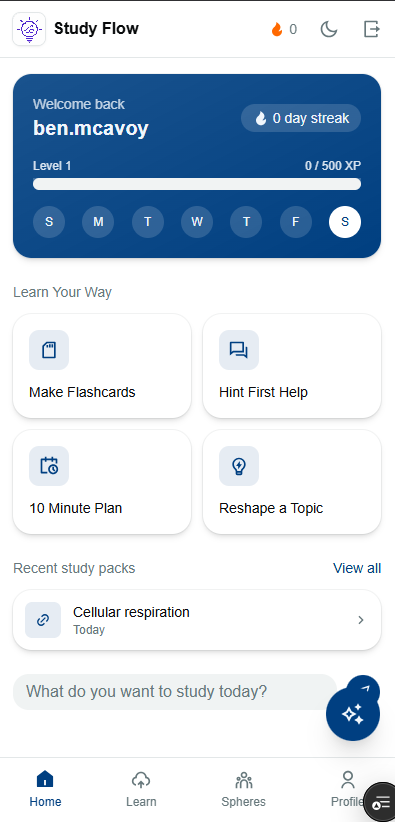
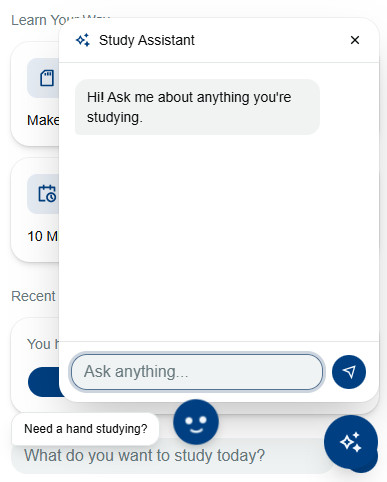

leaf hacks repo

study flow is a study app that turns your notes, photos, files, or links into a personalized study pack. gemini reshapes whatever you give it into flashcards, quizzes, and definitions matched to your learning style, then you work through it with quizzes, a chat assistant, and a bit of gamification (xp, streaks, squads) to keep you coming back.

## screenshots

<p>
  
  
</p>

## stack

- next.js 16 (app router), react 19, typescript
- tailwind css v4, shadcn/ui + base ui components
- firebase: auth, firestore, storage
- genkit + @genkit-ai/googleai for study pack generation, chat, grading, and tts

## getting started

1. install deps

   ```
   npm install
   ```

2. copy your firebase config and gemini api key into `.env.local` (see `lib/firebase.ts` and `lib/genkit.ts` for what's expected)

3. run the dev server

   ```
   npm run dev
   ```

4. open http://localhost:3000

## firebase setup

firestore rules live in `firestore.rules`, storage rules in `storage.rules`. deploy them with:

```
firebase deploy --only firestore,storage
```

note: storage rules being deployed doesn't mean the storage bucket exists, you still need to enable cloud storage for the project in the firebase console (build > storage > get started) before uploads will work.

## project layout

- `app/` - routes and pages (app router)
- `lib/` - firebase, firestore wrapper, ai helpers, storage, types
- `components/` - ui components, providers, shared widgets

see `app/(app)/upload/page.tsx` for the main upload flow and `lib/ai.ts` for the gemini-backed generation, chat, and grading logic.
